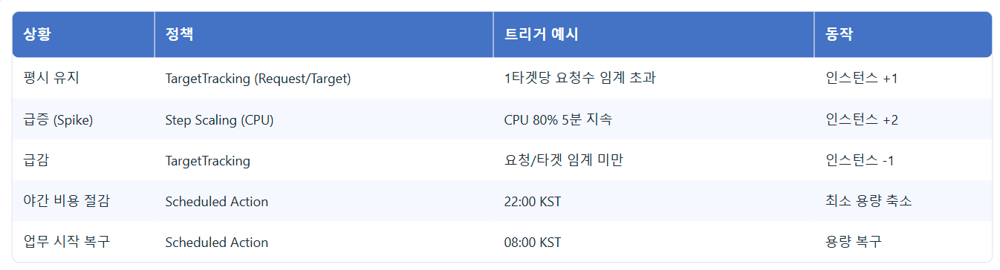

# Global Traffic Management on AWS

이 레포지토리는 **글로벌 환경에서 저지연 사용자 트래픽 관리**를 목표로, 트래픽 급증(Spike)에 자동 대응하고, **야간 비용을 최소화**하며, **실시간 모니터링/알림**을 갖춘 인프라 구성을 코드로 제공합니다.

---

## 1) 이 레포지토리의 코드가 하는 일
- **트래픽 관리 인프라 구성**: VPC(멀티 AZ), 보안 그룹, ALB, Auto Scaling Group(ASG), ElastiCache(Redis), CloudFront, Route 53, (옵션) DynamoDB Global Table.
- **자동 확장/축소**: Target Tracking(요청/타겟), Step Scaling(CPU) 기반 확장. 스케줄 액션(야간/주간)으로 비용 최적화.
- **모니터링/알림**: CloudWatch 대시보드·지표·알람, SNS 알림 채널.
- **부하 테스트 대비**: Locust로 TPS·지연·에러율 검증을 위한 사전 인프라 구성.

> 다이어그램(평시 / 스파이크)은 아래 “아키텍처 다이어그램”에 첨부.

---

## 2) 단계별 구현 (총 11단계)

### 01. 네트워크 기본 구성 (VPC/서브넷/라우팅)
- VPC, **멀티 AZ** 퍼블릭/프라이빗 서브넷, 라우팅, IGW/NAT 구성.
- 원칙: **ALB=퍼블릭**, **애플리케이션 인스턴스=프라이빗**.

### 02. 보안 경계/보안 그룹
- ALB, ASG(EC2), Redis **역할별 SG 분리**.
- 최소 포트 오픈, 인바운드/아웃바운드 흐름을 **레이어별 최소 권한**으로 제한.

### 03. 애플리케이션 로드 밸런서(ALB)
- HTTP/HTTPS 리스너와 타깃그룹(헬스체크) 구성.
- 무중단 트래픽 분산/장애 인스턴스 격리.

### 04. Auto Scaling Group (ASG)
- Launch Template, 멀티 AZ 배치, **최소/최대/원하는 용량** 설정.
- 배포/확장 시 헬스체크·쿨다운 포함한 안정 동작 고려.

### 05. ElastiCache (Redis)
- 세션/단기 데이터 캐시로 **DB 의존도·지연 감소**.
- Redis Subnet Group·SG 구성으로 프라이빗 통신.

### 06. DynamoDB Global Table
- 글로벌 데이터 동기화 구조 설계(세션 메타/랭킹 등).
- 다지역 확장 시 **읽기 지연 최소화**와 **내결함성**을 위한 선택지로 포함.

### 07. CloudFront (+ 선택: WAF)
- 전 세계 엣지로 **정적/동적 가속**.
- WAF 연동 시 L7 보호 룰 적용(봇·OWASP Top 10 대응 등).

### 08. Route 53
- 도메인/레코드 관리, 헬스체크/지리 기반 라우팅(옵션).
- 페일오버/DR 및 지역별 사용성 개선.

### 09. 모니터링 (CloudWatch)
- 대시보드와 주요 지표 수집: **ALB 지연/오류**, **EC2 CPU/네트워크**, **ASG InService 수** 등.
- 운영 가시성을 위한 지표 표준화.

### 10. 알람 & 자동 확장 정책
- **Target Tracking**(요청/타겟)으로 평시 자동 튜닝.
- **Step Scaling**(CPU)로 급격한 스파이크 대응.
- 확장/축소 쿨다운과 배치 보호로 **과도 확장 방지**.

### 11. 야간 비용 최소화 스케줄 (Scheduled Actions)
- **NightlyScaleDown / DaytimeScaleUp** 시간대 스케일 조정.
- SLA는 유지하면서 **비용을 안정적으로 절감**.

---

## 3) 전체 아키텍처 개요

### 평시 (Normal)
- 사용자 → **Route 53** → **CloudFront** → **ALB** → **ASG(EC2)** → **Redis** → **DynamoDB Global Table**
- **CloudWatch** 지표 수집, **SNS**로 알람 전파
- **스케줄 액션**으로 야간 최소 용량 유지

### 트래픽 스파이크 (Spike)
- **요청/타겟·CPU** 임계 초과 시 TargetTracking/Step Scaling으로 **인스턴스 자동 증설**
- 캐시 적중률로 백엔드 부하 흡수, 글로벌 테이블(선택)로 지역 간 지연 최소화
- 스파이크 해소 후 **쿨다운을 거쳐 자동 축소**

---

## 아키텍처 다이어그램

### 평시 아키텍처

### 트래픽 스파이크 아키텍처

---

## 스케일링 정책 요약

---

## 테스트 결과 요약
- Locust를 활용하여 부하 테스트를 진행.
- 테스트 진행 시 cvs파일 및 그래프 작성.
- CloudWatch 지표 수집 가능 확인.
- 일부 환경 제약으로 Auto Scaling 이벤트 발생이 제한됨.
- CPU 병목 발생 → **더 좋은 테스트 환경에서 재실행 필요**.

---

## 향후 계획
- **DynamoDB Global Table**: 현재 설계만 완료, 실제 연결 및 테스트 예정.
- **CloudFront 경유 부하 테스트**: 로컬 환경 한계로 미완료, 재시도 필요.
- **DynamoDB 부하 테스트**: 환경 제약으로 실패, 차후 환경 확장 후 진행.
- **Auto Scaling 동작 검증**: JMeter/Locust 부하 재테스트 필요.
- 보안 측면 강화: 데이터 암호화 방식(Aurora, Redis, DynamoDB) 검토 및 적용 예정.

---

## 모니터링·알림 지표(예시)

- **ALB**: `TargetResponseTime`, `HTTPCode_Target_5XX_Count`, `RequestCount`
- **EC2/ASG**: `CPUUtilization`, `NetworkIn/Out`, `GroupInServiceInstances`
- **Redis**: 연결 수, 명령 처리량, 미스율
- **알람**: 경고/심각 임계 분리, SNS 채널 연동

---

## 라이선스
Apache-2.0
